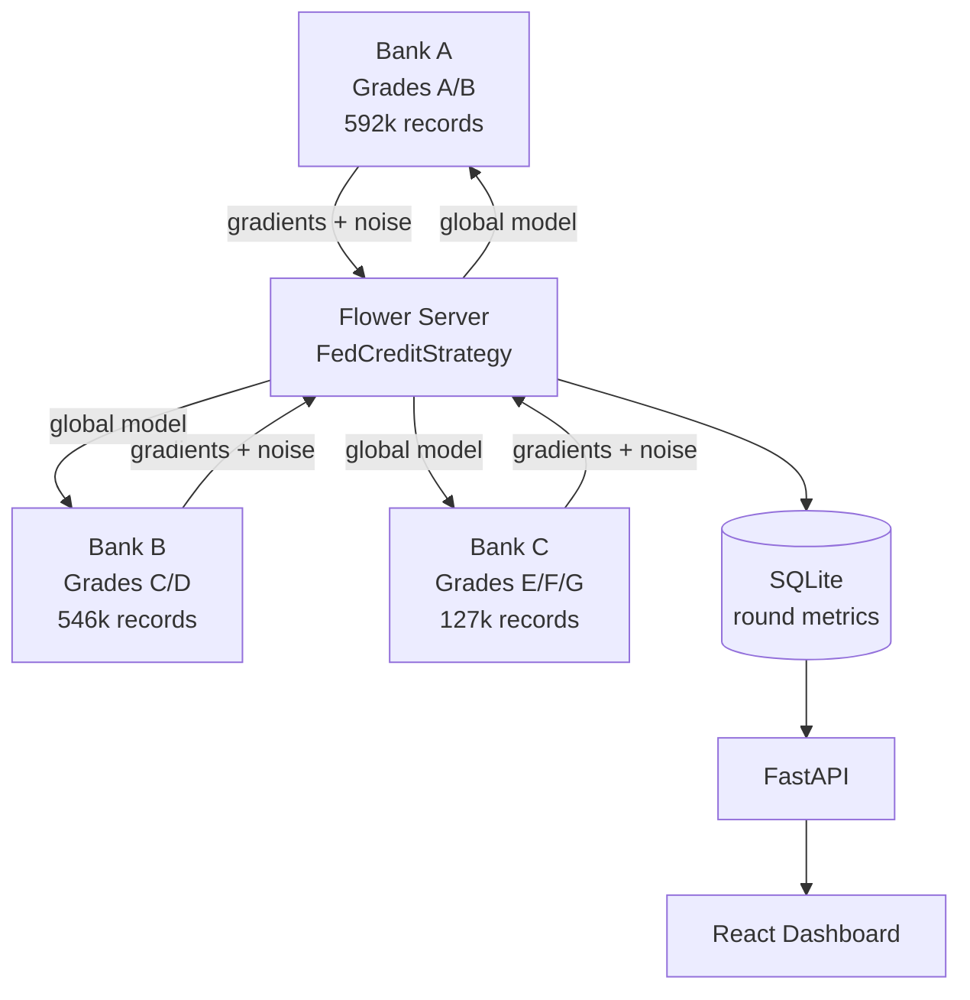
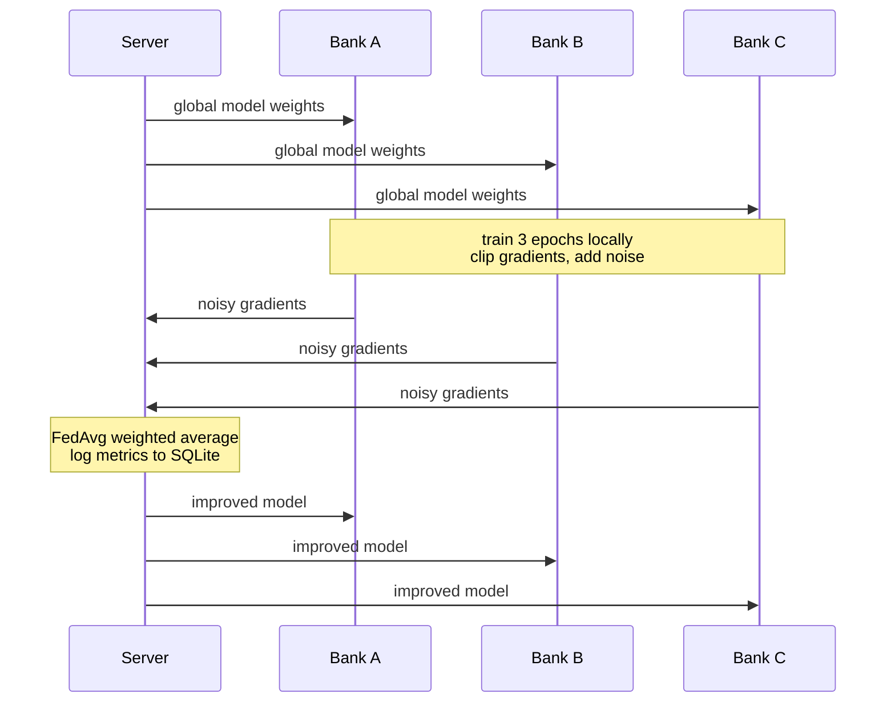
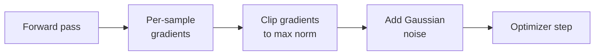

## FedCred
FedCred is a federated learning system for privacy preserving credit risk modeling across financial institutions using differential privacy. FedCred works by incorporating three simulated banks that collaboratively train a shared credit scoring model without sending customer data to each other. 
Each bank trains locally on its own data of borrowers. Only gradient updates, the mathematical signal for how the model should improve is what leaves each bank's server. A central aggregator averages those signals using FedAvg and sends back an improved global model, this process repeats while no raw data ever leaves any bank.

## The Problem Source
Since banks need data to build efficient credit models, when the data becomes abundant efficiency of the model needs to be maintained with better fraud detection and fewer missed defaults. But the best data is locked inside competitors. A combined model from 2 different banks that have >50 million customers each would be more powerful to catching patterns that neither can see alone. But the data cannot be combined due to federal regulations such as GLBA which prevents sharing non public personal financial data. Regulators would also never approve a data sharing contract between competing financial institutions. 

## Solution
Utilizing the concept of federated learning allows for the the model itself to be moved to the data instead of the data being moved to a central server. Each bank trains locally on its own customers and only the gradient gets updated.The gradient is the mathematical signal for how the model weights should shift to which it travels back to the central aggregator.

## Architecture
 

### One Federated Round
 

 
---
Data for each borrower can be different. Utilizing the concept of IID ( Independent and identically distributed) which is the assumption in ML that every piece of your data looks statistically like every other piece in a opposite way meaning Non-IID focuses on breaking that notion. Each client's data comes from a different distribution. For example a local credit union's borrowers will differ from a national card issuer's. 

The 3 banks used are split by loan grade, giving each a realistic different borrower population to mimic the situation real banks are in. 

| Bank | Loan Grades | Records | Default Rate |
|---|---|---|---|
| Bank A | A, B | 592,053 | 10.3% |
| Bank B | C, D | 546,457 | 24.7% |
| Bank C | E, F, G | 127,199 | 40.5% |

This is where FedAvg comes into play, because of the differences in each Bank's gradients FedAvg has to reconcile them into a model that works for all three. 
---

## Privacy Layer

Gradient updates by themselves can in used to reconstruct training data in theory. Using Opacus to maintain differential privacy prevents this by clipping per sample gradients and placing calibrated Gaussian noise before anything leaves the client. 


Privacy is parameterized by epsilon (ε). The lower ε is correlates to more noise which is stronger privacy and lower accuracy. The privacy and utility tradeoff is a case that is measurable as shown below: 

| ε | Privacy | Training Time | Notes |
|---|---|---|---|
| ∞ | none (baseline) | ~11 min | no noise added |
| 10 | moderate | ~4.3 hrs | per-sample gradients are expensive |
| 5 | strong | ~6 hrs | per-sample gradients more expensive than ε=10 |
| 1 | strongest | 10.6 hrs | per-sample gradients more expensive than ε=10 and ε=5 and therefore would not be utilized |

The per sample gradient computation is and gets more expensive than batch gradients.
---

## Tech Stack

| Layer | Tools |
|---|---|
| Federated Learning | Flower (flwr) — FedAvg, gRPC client/server |
| Model | PyTorch — 3-layer feedforward net |
| Privacy | Opacus — gradient clipping + noise injection |
| Data | Lending Club (2007–2018), Pandas, Scikit-learn |
| Persistence | SQLite — per-round metric logging |
| API | FastAPI + Pydantic |
| Frontend | React + Recharts |

---


## Running It
 
### Prerequisites
 
- Python 3.11+
- Node.js 20+
- The [Lending Club dataset](https://www.kaggle.com/datasets/wordsforthewise/lending-club) (`accepted_2007_to_2018Q4.csv`)
### 1. Install dependencies
 
```bash
pip install -r requirements.txt
cd frontend && npm install && cd ..
```
 
### 2. Prepare the data
 
Place `accepted_2007_to_2018Q4.csv` in `Data/`, then:
 
```bash
python preprocessing/data.py
python preprocessing/feature_engineering.py
```
 
This produces per-bank train/test splits and scalers in `Data/processed/`.
 
### 3. Run federated training
 
Needs **four terminals**. Start the server first and wait for `waiting for 3 clients`.
 
```bash
# Terminal 1 — server
python flower_serv_clients/server.py
 
# Terminal 2 — Bank A
$env:BANK_ID="a"; python flower_serv_clients/client.py
 
# Terminal 3 — Bank B
$env:BANK_ID="b"; python flower_serv_clients/client.py
 
# Terminal 4 — Bank C
$env:BANK_ID="c"; python flower_serv_clients/client.py
```
 
> On macOS/Linux use `BANK_ID=a python flower_serv_clients/client.py` instead.
 
Training runs 10 rounds and writes metrics to `api/fedcredit.db`. The final global model is saved to `flower_serv_clients/global_model.pth`.
 
**To enable differential privacy:** set `self.epsilon` in `client.py` to `1`, `5`, or `10`. Leave it as `float('inf')` for the no-privacy baseline. Expect DP runs to take significantly longer.
 
### 4. Start the API
 
```bash
cd api
python -m uvicorn main:app --reload
```
 
Swagger docs available at `http://127.0.0.1:8000/docs`.
 
### 5. Start the dashboard
 
```bash
cd frontend
npm start
```
 
Opens at `http://localhost:3000`.
 
---
